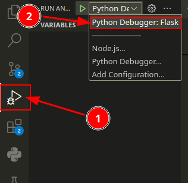

# Cómo colaborar

## Requisitos de software

- Docker (opcional)
- Mongo
- Minio

Puede usar sus instalaciones locales de Mongo y Minio, en caso de que prefiera utilizar contenedores, el proyecto cuenta con un [`docker-compose.yaml`](../docker-compose.yaml), su configuración depende del archivo `.env`, ofrecemos la muestra de ejemplo en [`example.env`](../example.env).

Más información sobre docker puede agregarse en un futuro, una vez haya avanzado más el proyecto.

## Pasos básicos

- Clonar el repositorio
- Instalar sus dependencias en entorno virual
- Configurar entorno con el archivo `.env`

No olvides hacer una copia de `example.env` a `.env` para evitar subir secretos sensibles de la aplicación.

## Breve explicación de la arquitectura de directorios

El sistema del backend se halla en el directorio [`backend`](../backend/), allí encontrarás los distintos modulos que componen al sistema, algunos especializados en la comunicación con el cliente - la [`api`](../backend/api/) que recibe las peticiones - y otros en la conexión con la base de datos, validación de datos, almacenamiento de objetos, autenticación, etc.

``` bash

# por transacciones entiendase acciones, como guardar, crear, actualizar, leer, eliminar
backend
├── api <---------------- sus subdirectorios comprenden los distintos modulos de la api
│   ├── admin <---------- endpoints relacionados a transacciones de administrador
│   ├── documento <------ endpoints relacionados a transacciones de documentos
│   └── usuario <-------- endpoints relacionados a transacciones de usuario
│
├── database <----------- modulo de conexion a la base de datos
├── models <------------- modulo de clases que gestionaran transacciones con sus contrapartes en la base de datos
├── object_storage <----- modulo de conexion a minio
└── schemas <------------ validacion de datos con pydantic

```

## Algunas consideraciones

- Nombrar a las variables con notación `snake_case`
- Nombrar a clases con notación `PascalCase`
- No hardcodear información sensible:
  - contraseñan
  - nombres de usuario
  - llaves api
  - emails
- nombrar a los submodulos/archivos de modulos api como verbos, ya que el sustantivo estara dado por el directorio/modulo:
  - leer
  - crear
  - guardar
  - eliminar

## Flujo GIT

Trabajaremos con un flujo llamado feature branch, donde los commits no se hacen de manera directa a main, si no a ramas donde se elabora una nueva funcionalidad (feature) o se corrige un error (fix, hotfix) o se refactoriza código (refactor).

## Correr y depurar Flask desde VSCode

Para correr y depurar la aplicacion Flask desde VSCode, es decir, ejecutar paso a paso, inspeccionar variables durante la ejecucion y demas, copia el contenido del archivo [`flask-launch.json`](flask-launch.json) a un directorio que se llame `.vscode` en la [raiz del proyecto](/), dentro de ese directorio crea un archivo llamado `launch.json` y copia la configuracion. Luego en `Run and Debug` y selecciona la opcion para depurar Flask:



Ahora podras iniciar la aplicacion desde vscode sin necesidad de la linea de comando al apretar `F5`